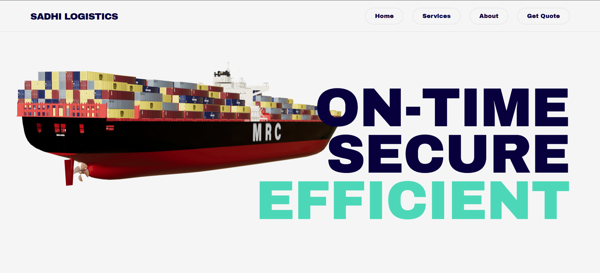
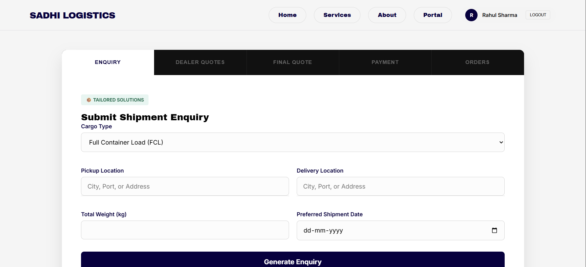

# LogiWeb

LogiWeb is a modern, web-based logistics and supply chain management platform designed to streamline transportation services, cargo handling, and client interactions. It provides an intuitive interface for users to explore services, request quotes, and manage logistics operations efficiently.

---

### 📸 Core Platform Interface
Here is a look at the primary user interface and layout (scroll horizontally to see more):

<div style="display: flex; gap: 10px; overflow-x: auto; padding-bottom: 10px;">
  
  
  
  
</div>

### Architecture & Workflows
The project's design and structural layout are mapped out below:

 *(Replace this with your diagram file path)*

---

## ✨ Features

*   **User-Centric Homepage:** An interactive and clean entry point for clients to understand logistics offerings.
*   **Quote Request System (`get-quote.html`):** An intuitive form interface allowing potential clients to request pricing for custom cargo and shipping needs.
*   **Service Overview (`services.html`):** Detailed breakdown of transportation modes, cargo handling capability, and supply chain solutions.
*   **Admin Dashboard (`admin.html` & `admin-login.html`):** A secure portal area for administrators to manage requests and monitor backend logistics operations.
*   **Responsive Design:** Optimized layout utilizing modern typography (Neue Haas Display) and structured CSS styling for cross-device compatibility.

---

## 🛠️ Tech Stack

*   **Frontend:** HTML5, CSS3, JavaScript (ES6+)
*   **Styling & Effects:** Custom scroll mechanics and modern typography layout
*   **Package Management:** npm / Yarn

---

## 🚀 Getting Started

### Prerequisites
Make sure you have [Node.js](https://nodejs.org/) installed on your machine.

### Installation

1. Clone the repository:
   ```bash
   git clone [https://github.com/Hrshvrma7/LogiWeb.git](https://github.com/Hrshvrma7/LogiWeb.git)

2. Navigate into the project directory:
   ```bash
   cd LogiWeb

3. Install the dependencies:
   ```Bash
   npm install
   # OR if you prefer yarn
   yarn install

